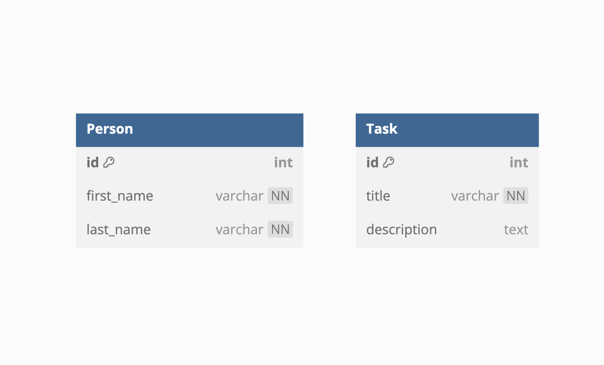
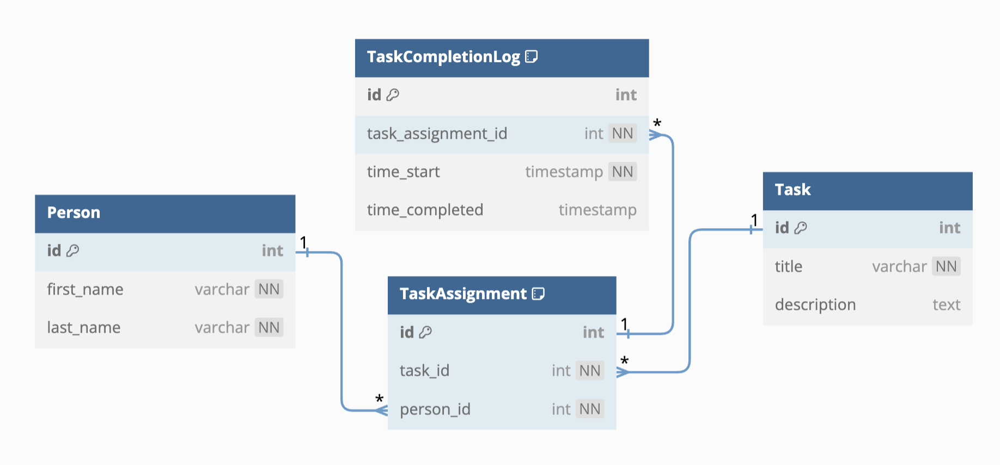

# Q2 - Architecture Optimization and Improvement

Person

- id PK
- first_name CharField
- last_name CharField

Task

- id PK
- title CharField
- description TextField

In this task, we want you to create a simple database model design. There are already two models named `Person` and `Task` as can be seen above.

Beforehand, tasks were assigned to only one person so that there were no task models; but from now on, tasks will be assigned to different people and we must store the frequency and last completion time of tasks by person. You must redesign these models and their fields to provide this ability. If you need to create new fields or new models, you can create them.

After the database model design, we want you to create a function that returns the list of frequency values for all Person-Task pairs.

For this task, you must deliver an entity-relationship diagram and a function to get the requested data.

## Given Design



As we can see, given design has a one-to-one (1-1) relationship between `Person` and `Task` models. We need to store the frequency and last completion time of tasks by person. To achieve this, we need to create a new model named `TaskAssignment` that has a many-to-many relationship with `Person` and `Task` models. This new model will store the information of number of task-person pairs. Therefore we can calculate the frequency of tasks by person.

## Solution

### Many-to-Many



#### `TaskAssignment` Table

- **Purpose**: Manages the linkage between tasks and persons, indicating which tasks are assigned to which persons.
- **Fields and Keys**:
  - `task_id` and `person_id`: These foreign keys link the `TaskAssignment` directly to the specific `Task` and `Person`, establishing a many-to-many relationship through this associative table.
  - **Indexing**: The composite index on (`task_id`, `person_id`) enhances the efficiency of queries involving both task and person lookups, which is crucial for operations that need to retrieve task assignments quickly.
- **Functionality**: This table is critical for tracking which tasks are currently assigned, laying the groundwork for logging their completions.

#### `TaskCompletionLog` Table

- **Purpose**: Logs each instance when a task is started and completed, focusing on the specifics of each assignment's execution.
- **Fields and Keys**:
  - `task_assignment_id`: A foreign key that connects each entry in this log to a specific task assignment, thereby providing a direct link to both the task and the person involved through the `TaskAssignment` table.
  - `time_start` and `time_completed`: These timestamps are vital for tracking the duration and completion times of tasks.
  - **Indexing**: The index on `task_assignment_id` ensures that all logs related to a specific task assignment can be retrieved efficiently, which is vital for performance in scenarios with frequent access patterns.
- **Functionality**: This table is crucial for recording detailed completion data, enabling the analysis of task execution and frequency calculations.

### References

- Foreign keys establish relational integrity between entities:
  - `Person.id` < `TaskAssignment.person_id`
  - `Task.id` < `TaskAssignment.task_id`
  - `Person.id` < `TaskCompletionLog.person_id`
  - `Task.id` < `TaskCompletionLog.task_id`
- **Rationale**: These references ensure that tasks and persons associated with assignments and completions are valid and exist in their respective tables. It safeguards the database against orphan records and maintains data consistency across the schema.

This design effectively separates concerns by distinguishing between ongoing task assignments and historical completions, optimizing both operational needs (like viewing current assignments) and analytical requirements (like reviewing task completion histories).

### Frequency Calculation Compatibility

The structure supports calculating the frequency of task completions by utilizing the `TaskCompletionLog`. The linkage via `task_assignment_id` allows to aggregate completion data directly back to both the specific task and person involved without ambiguity.

```sql
SELECT management_taskassignment.person_id, management_taskassignment.task_id,
COUNT(management_taskcompletionlog.id) AS frequency
FROM management_taskcompletionlog
INNER JOIN management_taskassignment ON (management_taskcompletionlog.task_assignment_id = management_taskassignment.id)
WHERE management_taskcompletionlog.time_completed >= "2024-08-20 12:58:32.173657"
GROUP BY management_taskassignment.person_id, management_taskassignment.task_id
ORDER BY management_taskassignment.person_id ASC, management_taskassignment.task_id ASC
```

## Installation & Dependencies

Before running the project, make sure you have the python 3.11.9 installed as virtual environment.

1. As first step, install required packages by running the following command in the terminal:

  ``` bash
  pip install -r requirements.txt
  ```

2. Create the database by running the following command in the terminal:

  ``` bash
  python manage.py makemigrations
  python manage.py migrate
  ```

## Use

First of all, you need to populate the database with some data. You can do this by running the following command in the terminal:

``` bash
python manage.py populate_data
```

number_of_person = 4
number_of_tasks = 5
number_of_assignments = 10

Example for creating 4 person and 5 tasks and 10 assignments. Note that the task assignments are randomized so it is possible to have less than 10 assignments. After this step, the command will automatically finish the tasks with 30 day range. The output will be like this:

``` bash
Created Person - 0
Created Person - 1
Created Person - 2
Created Person - 3
Created Task - 0
Created Task - 1
Created Task - 2
Created Task - 3
Created Task - 4
Assigned Task - Task0 to Alfa0 Theta0
Assigned Task - Task1 to Alfa0 Theta0
Assigned Task - Task3 to Alfa0 Theta0
Assigned Task - Task4 to Alfa0 Theta0
Assigned Task - Task0 to Alfa0 Theta0
...
Assigned Task - Task4 to Alfa3 Theta3
Assigned Task - Task0 to Alfa3 Theta3
Assigned Task - Task1 to Alfa3 Theta3
Tasks completed by Alfa0 Theta0 for Task0
Tasks completed by Alfa0 Theta0 for Task1
Tasks completed by Alfa0 Theta0 for Task3
...
Tasks completed by Alfa3 Theta3 for Task4
Tasks completed by Alfa3 Theta3 for Task0
Tasks completed by Alfa3 Theta3 for Task1
Successfully seeded the database.
```

The calculation of the frequency of tasks by person can be done by running the following command in the terminal:

``` bash
python manage.py frequency <range_day> <human_readable>
```

Example usage 1:

``` bash
python manage.py frequency 30 0
```

This example fetches and displays 30 day frequency data for all Person-Task pairs without human readable output. Example output:

``` bash
[{'task_assignment__person__id': 1, 'task_assignment__task__id': 1, 'frequency': 9}, {'task_assignment__person__id': 1, 'task_assignment__task__id': 2, 'frequency': 8}, {'task_assignment__person__id': 1, 'task_assignment__task__id': 3, 'frequency': 5}, {'task_assignment__person__id': 1, 'task_assignment__task__id': 4, 'frequency': 9}, {'task_assignment__person__id': 1, 'task_assignment__task__id': 5, 'frequency': 7}, {'task_assignment__person__id': 2, 'task_assignment__task__id': 1, 'frequency': 6}, {'task_assignment__person__id': 2, 'task_assignment__task__id': 2, 'frequency': 6}, {'task_assignment__person__id': 2, 'task_assignment__task__id': 3, 'frequency': 10}, {'task_assignment__person__id': 2, 'task_assignment__task__id': 4, 'frequency': 8}, {'task_assignment__person__id': 2, 'task_assignment__task__id': 5, 'frequency': 6}, {'task_assignment__person__id': 3, 'task_assignment__task__id': 1, 'frequency': 7}, {'task_assignment__person__id': 3, 'task_assignment__task__id': 2, 'frequency': 9}, {'task_assignment__person__id': 3, 'task_assignment__task__id': 3, 'frequency': 8}, {'task_assignment__person__id': 3, 'task_assignment__task__id': 4, 'frequency': 9}, {'task_assignment__person__id': 3, 'task_assignment__task__id': 5, 'frequency': 6}, {'task_assignment__person__id': 4, 'task_assignment__task__id': 1, 'frequency': 6}, {'task_assignment__person__id': 4, 'task_assignment__task__id': 2, 'frequency': 9}, {'task_assignment__person__id': 4, 'task_assignment__task__id': 3, 'frequency': 8}, {'task_assignment__person__id': 4, 'task_assignment__task__id': 4, 'frequency': 5}, {'task_assignment__person__id': 4, 'task_assignment__task__id': 5, 'frequency': 8}]
```

Example usage 2:

``` bash
python manage.py frequency 30 1
```

This example fetches and displays 30 day frequency data for all Person-Task pairs with human readable output. Example output:

``` bash
Person ID: 1, Task ID: 1, Frequency: 9
Person ID: 1, Task ID: 2, Frequency: 8
Person ID: 1, Task ID: 3, Frequency: 5
Person ID: 1, Task ID: 4, Frequency: 9
Person ID: 1, Task ID: 5, Frequency: 7
Person ID: 2, Task ID: 1, Frequency: 6
Person ID: 2, Task ID: 2, Frequency: 6
Person ID: 2, Task ID: 3, Frequency: 10
Person ID: 2, Task ID: 4, Frequency: 8
Person ID: 2, Task ID: 5, Frequency: 6
Person ID: 3, Task ID: 1, Frequency: 7
Person ID: 3, Task ID: 2, Frequency: 9
Person ID: 3, Task ID: 3, Frequency: 8
Person ID: 3, Task ID: 4, Frequency: 9
Person ID: 3, Task ID: 5, Frequency: 6
Person ID: 4, Task ID: 1, Frequency: 6
Person ID: 4, Task ID: 2, Frequency: 9
Person ID: 4, Task ID: 3, Frequency: 8
Person ID: 4, Task ID: 4, Frequency: 5
Person ID: 4, Task ID: 5, Frequency: 8
```
